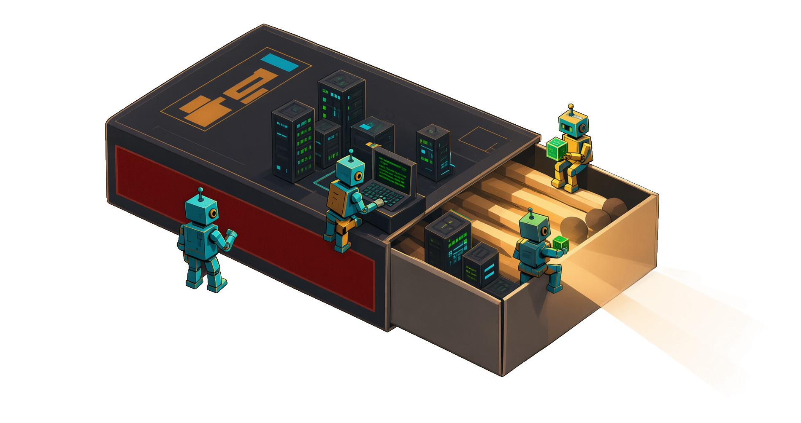

# ai-korobok

**Your AI agents, in a box.**



`ai-korobok` spins up a disposable QEMU/libvirt VM preloaded with Python, Node.js, and
Docker — a safe, throwaway sandbox for running AI agents, MCP servers, and whatever else
you don't want loose on your host. KVM-accelerated when available, TCG when not, with
real-time host↔VM file sharing and host port forwarding baked in.

> Create it. `ssh` in. Run your agents. `destroy` it. No muss, no leftover state.

## Quick Start

```bash
# 1. Install host dependencies (run once, requires root)
sudo ./setup.sh

# 2. Log out and back in (for libvirt group membership)

# 3. Create your config from the example
cp config.example.json config.json
# Edit config.json to your preferences (optional)

# 4. Create and start the VM
./vm.sh create

# 5. SSH into the VM
./vm.sh ssh
```

## Prerequisites

- Linux host: Ubuntu/Debian or Fedora, macOS, or Windows via WSL2
  (see [macOS Support](docs/macos.md) / [Windows Support](docs/windows.md))
- Root/sudo access for initial setup
- ~2GB free disk for cloud image + configured disk size
- Internet connection for downloading the cloud image and VM packages
- Ansible (auto-installed by `setup.sh` if missing; not needed on macOS)

## macOS Support

macOS hosts are supported through a Homebrew-based setup path; see
[docs/macos.md](docs/macos.md) for installation steps and current limitations.

## Windows Support

Windows is supported via WSL2; libvirt and QEMU run inside the WSL2 Linux distribution.
See [docs/windows.md](docs/windows.md) for setup steps, KVM/nested-virtualization
details, and limitations.

## Commands

| Command                 | Description                                                                 |
| ----------------------- | --------------------------------------------------------------------------- |
| `./vm.sh create`        | Download cloud image, generate cloud-init, create disk, define and start VM |
| `./vm.sh start`         | Start an existing stopped VM                                                |
| `./vm.sh stop`          | Graceful ACPI shutdown (60s timeout, then force)                            |
| `./vm.sh destroy`       | Force stop + undefine + delete disk images + cleanup                        |
| `./vm.sh ssh`           | SSH into the VM using auto-generated key                                    |
| `./vm.sh status`        | Show VM state, IP, resource usage, port forwards                            |
| `./vm.sh export`        | Package qcow2 + XML + config + keys into a tarball                          |
| `./vm.sh import <file>` | Unpack tarball, define domain, ready to start                               |
| `./vm.sh list-ports`    | Show configured port forwarding rules                                       |

## Configuration

Edit `config.json` to customize the VM:

```json
{
  "vm_name": "ai-vm",
  "vcpus": 4,
  "memory_mb": 8192,
  "disk_gb": 50,
  "disk_path": "/var/lib/libvirt/images/ai-vm.qcow2",
  "shared_dir": {
    "host_path": "/home/dev/ai-workspace",
    "mount_tag": "ai-workspace",
    "mount_point": "/mnt/workspace"
  },
  "port_forwards": [
    { "host": 2222, "guest": 22, "protocol": "tcp" },
    { "host": 8080, "guest": 80, "protocol": "tcp" },
    { "host": 3000, "guest": 3000, "protocol": "tcp" },
    { "host": 3001, "guest": 3001, "protocol": "tcp" }
  ],
  "network": {
    "type": "nat",
    "bridge": "virbr0"
  },
  "gpu_passthrough": false,
  "os_variant": "ubuntu24.04"
}
```

### Key Fields

- **vcpus**: Number of virtual CPUs (default: 4)
- **memory_mb**: RAM in megabytes (default: 8192)
- **disk_gb**: Disk size in gigabytes (default: 50)
- **shared_dir**: virtiofs host↔VM shared directory
- **port_forwards**: List of host→guest port mappings
- **gpu_passthrough**: Set to `true` to pass through a discrete GPU (requires IOMMU)

## What's Installed in the VM

The cloud-init provisioning automatically installs:

- Python 3 + pip + venv
- Node.js 22 LTS
- Docker CE + Docker Compose
- Common AI packages: `openai`, `anthropic`, `httpx`, `uvicorn`, `fastapi`, `pydantic`
- Git, curl, htop, ripgrep, build-essential

## Shared Directory

The host directory configured in `shared_dir.host_path` is mounted inside the VM at the configured `mount_point` using virtiofs. Changes are reflected in real-time in both directions.

## Port Forwarding

Port forwards are managed via iptables DNAT rules. They are applied on `create`/`start` and removed on `stop`/`destroy`. Rules are tracked in `.state/iptables-rules` for clean removal.

Default forwards:

- `localhost:2222` → VM `22` (SSH)
- `localhost:8080` → VM `80` (HTTP)
- `localhost:3000` → VM `3000` (app server)
- `localhost:3001` → VM `3001` (MCP server)

## KVM Acceleration

If `/dev/kvm` is available, the VM uses hardware acceleration (KVM) for near-native performance. If not available (e.g., running inside a container), the VM falls back to TCG software emulation — functional but noticeably slower.

To check: `ls -la /dev/kvm`

To enable KVM on bare metal:

```bash
sudo modprobe kvm_intel   # Intel CPUs
sudo modprobe kvm_amd     # AMD CPUs
```

## GPU Passthrough

Set `gpu_passthrough: true` in config.json to pass through a discrete GPU. Requirements:

- IOMMU enabled in BIOS
- IOMMU enabled in kernel (`intel_iommu=on` or `amd_iommu=on` in GRUB)
- GPU not in use by the host
- GPU PCI ID detected via `lspci`

## Export/Import

Export a VM for portability:

```bash
./vm.sh export    # creates ai-vm-export-YYYYMMDDHHMMSS.tar.gz
```

Import on another host:

```bash
./vm.sh import ai-vm-export-YYYYMMDDHHMMSS.tar.gz
./vm.sh start
```

## Project Structure

```
ai-vm-manager/
├── config.example.json  # Example VM configuration (copy to config.json)
├── vm.sh                # Main CLI management script
├── setup.sh             # Host dependency installer (thin wrapper for Ansible)
├── playbooks/
│   └── setup.yml        # Ansible playbook (Fedora + Debian/Ubuntu)
├── cloud-init/
│   ├── user-data        # Cloud-init user-data template
│   └── meta-data        # Cloud-init meta-data template
├── templates/
│   └── domain.xml       # Libvirt domain XML template
├── keys/                # Auto-generated SSH keypair
├── .state/              # Runtime state (created automatically)
│   ├── *.xml            # Generated domain XML
│   ├── *-seed.iso       # Cloud-init seed ISO
│   ├── iptables-rules   # Tracked port forwarding rules
│   └── virtiofsd.pid    # virtiofs daemon PID
└── README.md
```
